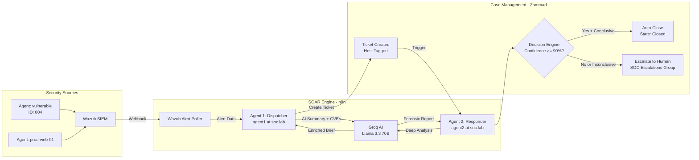

# SOC-Ai-Driven-Automation

<div align="center">

**AI-Driven Security Operations Center Automation**

A modular, Docker-based SOC automation system that autonomously detects, analyzes, and responds to security threats using AI-powered SOAR workflows.

[](LICENSE)
[](https://www.docker.com/)
[](https://wazuh.com/)
[](https://n8n.io/)
[](https://zammad.org/)
[](https://groq.com/)

</div>

---

## Overview

SOC-Ai-Driven-Automation is a production-grade Security Orchestration, Automation, and Response (SOAR) platform that combines open-source tools with AI to create a fully autonomous alert-to-resolution pipeline. It implements the NIST Incident Response lifecycle (Detection → Analysis → Containment → Eradication → Recovery) with built-in Human-in-the-Loop (HITL) safeguards.

### Core Components

| Component | Version | Purpose |
|-----------|---------|---------|
| **Wazuh Manager** | 4.14.3 | SIEM/XDR — Threat detection, log analysis, file integrity monitoring |
| **Wazuh Indexer** | 4.14.3 | Elasticsearch-based log storage and search |
| **Wazuh Dashboard** | 4.14.3 | Security operations dashboard |
| **n8n** | Latest | Workflow orchestration engine (SOAR backbone) |
| **Zammad** | 7.0 | Ticketing & case management with full audit trail |
| **Groq (Llama 3.3 70B)** | Latest | AI reasoning engine for threat analysis and CVE enrichment |

### Key Capabilities

- **Autonomous Alert Processing** — Wazuh alerts trigger automated AI-powered workflows
- **CVE Intelligence** — AI identifies related CVEs, provides explanations and host-specific mitigations
- **Confidence-Based Decision Engine** — Auto-resolves high-confidence threats (≥90%), escalates ambiguous ones
- **Conservatism Clause** — Administrative/privilege anomalies always escalate to humans regardless of AI confidence
- **Host-Aware Alerting** — Every ticket is tagged with the source hostname and agent ID
- **Authentication Failure Elevation** — Credential attacks are automatically elevated to Priority 2
- **Per-Agent Identity & Auditability** — Separate AI identities for forensic accountability
- **MITRE ATT&CK Mapping** — Automatic technique and tactic correlation
- **Human-in-the-Loop** — Analysts approve high-impact or ambiguous automated responses

---

## Architecture



### Identity & Audit Model

The system uses **segregated AI identities** to maintain a complete forensic audit trail:

| Identity | Zammad User | ID | Role |
|----------|-------------|-----|------|
| **Agent 1** (Dispatcher) | `agent1@soc.lab` | 78 | Creates tickets, initial AI triage |
| **Agent 2** (Responder) | `agent2@soc.lab` | 77 | Deep analysis, forensic notes, auto-resolve/escalate |
| **Senior Analyst** | `admin@soc.local` | 3 | Human-in-the-loop, escalation owner |

Every action is attributed: `created_by_id` = Agent 1, `updated_by_id` = Agent 2. This provides full chain-of-custody for SOC compliance.

---

## Autonomous Decision Engine

The system implements a **tiered confidence model** for autonomous threat resolution:

### Confidence Thresholds

| Confidence | Inconclusive | Action |
|------------|-------------|--------|
| >= 90% | `false` | **Auto-Close** — Ticket resolved with full forensic report |
| >= 90% | `true` | **Escalate** — Moved to SOC Escalations group, assigned to Senior Analyst |
| < 90% | Any | **Escalate** — Human review required |

### Conservatism Clause

The AI analyst is explicitly instructed to **always set `inconclusive: true`** for:
- Administrative access anomalies (logins, sudo, user creation)
- Privilege escalation indicators
- Any activity where intent is not 100% verifiable from logs alone

This ensures that high-privilege account activity is **never auto-resolved**, regardless of the AI's confidence score.

### Authentication Failure Elevation

Authentication failure alerts (typically Wazuh Level 5) are automatically elevated to **Priority 2** to ensure they are processed by the AI agents and never ignored as low-priority noise.

---

## Quick Start

### Prerequisites

| Resource | Minimum | Recommended |
|----------|---------|-------------|
| **OS** | Ubuntu 22.04 / Kali Linux 2026.1 | Kali Linux 2026.1 |
| **RAM** | 16 GB | 32 GB |
| **Disk** | 100 GB | 200 GB |
| **Docker** | 20.10+ | Latest |
| **Docker Compose** | v2+ | Latest |

### Installation

1. **Clone the repository:**
```bash
git clone https://github.com/AlonsoRodriguez-Am/SOC-Ai-Driven-Automation.git
cd SOC-Ai-Driven-Automation
```

2. **Start all services:**
```bash
chmod +x scripts/start-services.sh
./scripts/start-services.sh start
```

3. **Access the services:**

| Service | URL | Default Credentials |
|---------|-----|---------------------|
| Wazuh Dashboard | `https://localhost:443` | See [credentials-guide.md](./docs/credentials-guide.md) |
| n8n | `http://localhost:5678` | `admin` / set via env |
| Zammad | `http://localhost:8080` | `admin@soc.local` / `SOC_Admin_2026!` |

4. **Run the test suite to verify the pipeline:**
```bash
python3 n8n/workflows/soc_test_suite.py
```

---

## Project Structure

```
SOC-Ai-Driven-Automation/
├── README.md                          # This file
├── LICENSE                            # MIT License
├── docs/                              # General documentation
│   ├── architecture.md                # System architecture & data flow
│   ├── quick-reference.md             # Quick command reference card
│   ├── troubleshooting.md             # General troubleshooting guide
│   └── credentials-guide.md           # Credential management guide
├── wazuh/                             # Wazuh SIEM module
│   ├── README.md                      # Wazuh installation & config
│   ├── docker-compose.yml
│   ├── config/ossec.conf.example
│   ├── integration/README.md          # Alert forwarding integration
│   ├── agents/README.md               # Agent deployment guide
│   └── troubleshooting.md
├── zammad/                            # Zammad ticketing module
│   ├── README.md                      # Zammad installation & config
│   ├── docker-compose.yml
│   ├── config/custom-fields.json
│   ├── api/README.md                  # API integration guide
│   └── troubleshooting.md
├── n8n/                               # n8n SOAR module
│   ├── README.md                      # n8n installation & config
│   ├── MANAGEMENT.md                  # Workflow management guide
│   ├── docker-compose.yml
│   └── workflows/
│       ├── README.md                  # Workflow documentation
│       ├── wazuh-alert-poller.json    # Main alert receiver
│       ├── agent1-dispatcher.json     # AI-powered alert dispatcher
│       ├── agent2-responder.json      # Autonomous threat responder
│       ├── soc_test_suite.py          # Automated verification suite
│       └── antigravity_history.md     # Implementation checkpoint log
└── scripts/
    ├── wazuh-alert-forwarder.py       # Cron-based alert forwarder
    └── start-services.sh              # Service lifecycle management
```

---

## Workflow Overview

### Agent 1: The Dispatcher (`agent1@soc.lab`)

Receives Wazuh alerts and performs initial AI-powered triage:

1. **Trigger**: Wazuh alert via webhook (`POST /webhook/wazuh-alert`)
2. **Parse**: Extract alert details (rule, severity, MITRE ATT&CK, agent host)
3. **Elevate**: Authentication failures automatically promoted to Priority 2
4. **AI Brief**: Generate enriched summary with CVE identification using Groq (Llama 3.3 70B)
5. **Ticket**: Create Zammad ticket with host tag: `[WAZUH] [hostname] Alert Description`
6. **Audit**: Ticket `created_by_id` = Agent 1 (ID 78)

### Agent 2: The Responder (`agent2@soc.lab`)

Deep threat analysis with autonomous decision-making:

1. **Trigger**: Ticket created or manually invoked via webhook (`POST /webhook/agent2-responder`)
2. **Analyze**: Host-specific deep threat analysis with CVE correlation
3. **Assess**: Calculate confidence score (0-100%) with Conservatism Clause
4. **Decide**: If confidence >= 90% AND conclusive → **Auto-Close** with forensic report
5. **Escalate**: If inconclusive or low confidence → Move to **SOC Escalations** group, assign to **Senior Analyst**
6. **Audit**: All forensic notes attributed to Agent 2 (ID 77)

---

## Testing

### Automated Test Suite

The project includes a Python-based verification tool:

```bash
python3 n8n/workflows/soc_test_suite.py
```

**Scenarios tested:**

| Scenario | Alert | Expected Result |
|----------|-------|-----------------|
| 1. Critical CVE (Log4j) | Level 15, CVE-2021-44228 | Auto-Close (State 4) |
| 2. Sudo Anomaly | Level 10, non-standard sudo | Escalate to Human (Group 2, State 2) |
| 3. SSH Auth Failure | Level 5, `sshd: authentication failure` | P2 Priority, Host Tag `[vulnerable]` |

---

## Documentation Index

### Getting Started
- [Quick Start Guide](#quick-start)
- [Credentials Guide](./docs/credentials-guide.md)
- [Quick Reference Card](./docs/quick-reference.md)

### Module Documentation
- [Wazuh Installation & Configuration](./wazuh/README.md)
- [Wazuh Agent Deployment](./wazuh/agents/README.md)
- [Wazuh Alert Integration](./wazuh/integration/README.md)
- [Zammad Installation & Configuration](./zammad/README.md)
- [Zammad API Integration](./zammad/api/README.md)
- [n8n Installation & Configuration](./n8n/README.md)
- [n8n Workflow Documentation](./n8n/workflows/README.md)
- [n8n Workflow Management](./n8n/MANAGEMENT.md)

### Troubleshooting
- [General Troubleshooting](./docs/troubleshooting.md)
- [Wazuh Troubleshooting](./wazuh/troubleshooting.md)
- [Zammad Troubleshooting](./zammad/troubleshooting.md)
- [n8n Troubleshooting](./n8n/troubleshooting.md)

---

## Important Implementation Notes

### AI Provider: Groq (Llama 3.3 70B Versatile)

- **API Endpoint**: `https://api.groq.com/openai/v1/chat/completions`
- **Model**: `llama-3.3-70b-versatile`
- **Temperature**: `0.2` (low creativity for clinical accuracy)

> **Note**: Migrated from Google Gemini to Groq in March 2026 for improved performance and cost efficiency.

### Zammad API Format (v2 — Flat JSON)

Zammad 7.x requires flat JSON attributes. **Do not use the old `ticket: {}` wrapper.**

```json
{
  "title": "[WAZUH] [vulnerable] sshd: authentication failure",
  "group_id": 1,
  "customer_id": 2,
  "priority_id": 2,
  "state": "new",
  "soc_cve_list": "CVE-2021-44228",
  "article": {
    "body": "<h3>SOC Alert Briefing</h3><p>...</p>",
    "content_type": "text/html"
  }
}
```

### Docker Network Configuration

When n8n runs in Docker and needs to reach Zammad (separate compose stack), use the host Docker bridge gateway IP:

```
Working:  http://172.19.0.1:8080/api/v1/tickets.json
Fails:    http://localhost:8080/api/v1/tickets.json
```

Find your bridge IP: `ip addr show docker0 | grep inet`

---

## License

This project is licensed under the MIT License — see the [LICENSE](LICENSE) file for details.

---

## Acknowledgments

- [Wazuh](https://wazuh.com/) — Open source SIEM/XDR platform
- [n8n](https://n8n.io/) — Workflow automation engine
- [Zammad](https://zammad.org/) — Open source ticketing system
- [Groq](https://groq.com/) — High-performance AI inference
- [Meta Llama](https://llama.meta.com/) — Llama 3.3 70B language model